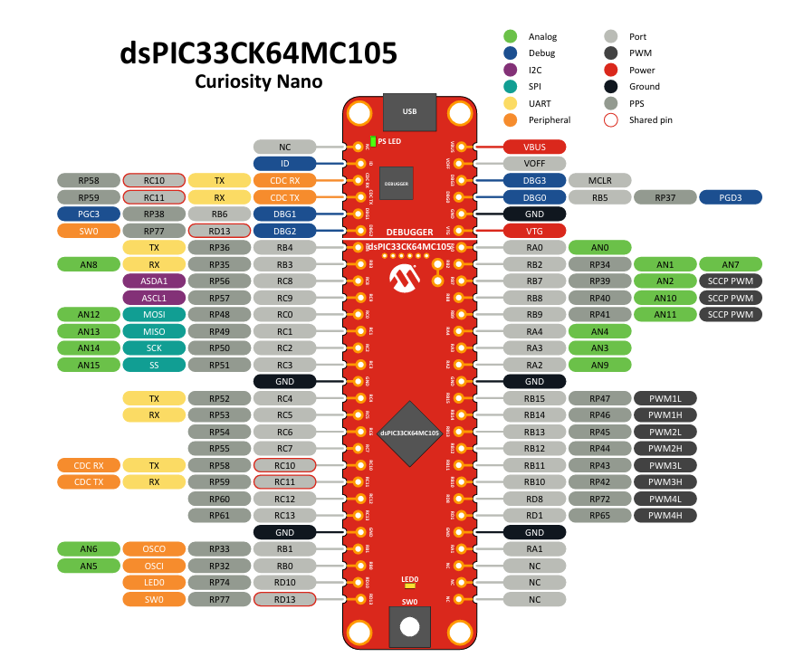
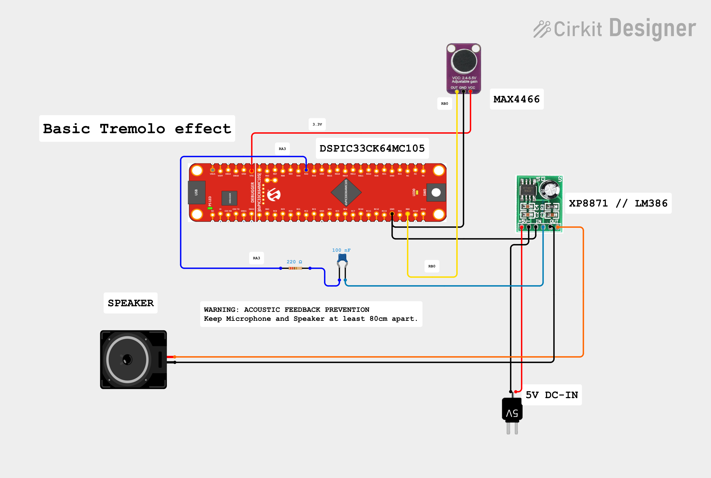

# DSP-audio-tremolo-dspic33ck
A practical laboratoy for real-time digital audio signal processing, featuring a noise gate and tremolo effect on the DSPIC33CK
## System architecture
to understand the real-time hardware workflow, see the diagram below:

## DSPC33CK64MC105 PinOut

## Wiring Diagram
Below is the hardware connection guide

## Technical Specifications 
* **Sampling Rate:** 16 kHz triggered via **SCCP1 Timer** interrupts.
* **ADC Configuration:** 12-bit resolution mapped to the `AN5/RB0` channel.
* **DAC Configuration:** Internal **High-Speed DAC** updated at the end of each ISR.
* **Processing:** **Fixed-point arithmetic** using native DSP bit-shifting (`>>`).
* **Noise Gate:** Evaluated in the ISR using absolute values (`abs()`) against a threshold.
