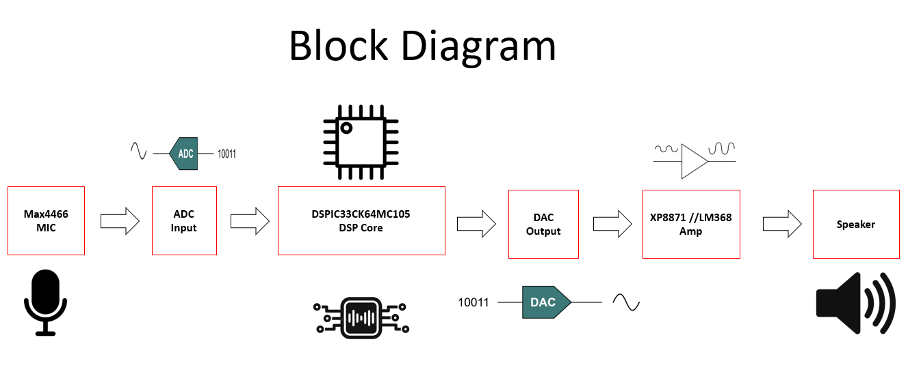

# DSP-audio-tremolo-dspic33ck
A practical laboratoy for real-time digital audio signal processing, featuring a noise gate and tremolo effect on the DSPIC33CK
## System architecture
to understand the real-time hardware workflow, see the diagram below:

